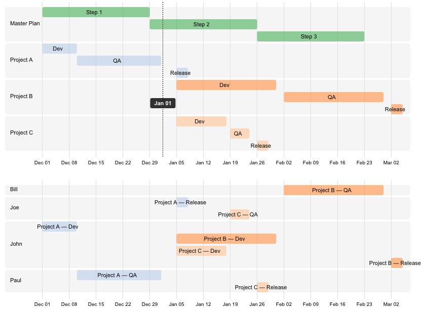

roadmap.js
===========

A simple roadmap display library.

Example
-------

Add a `<div class="roadmap">` in your page like this one:

```
<div class="roadmap">
Project A, Dev
2014-12-1 > 2014-12-9
John

Project A, QA
2014-12-10 > 2014-12-31
Paul
Joe

Project A, Release
2015-1-5 > 2015-1-7
Joe

Project B, Dev
2015-1-5 > 2015-1-30
John

Project B, QA
2015-2-2 > 2015-2-27
Bill
John

Project B, Release
2015-3-2 > 2015-3-4
John

Project C, Dev
2015-1-5 > 2015-1-17
John

Project C, QA
2015-1-19 > 2015-1-23
Joe

Project C, Release
2015-1-26 > 2015-1-28
Paul

Master Plan, Step 1
2014-12-1 > 2014-12-28

Master Plan, Step 2
2014-12-29 > 2015-1-25

Master Plan, Step 3
2015-1-26 > 2015-2-22
</div>
```
You will get:


